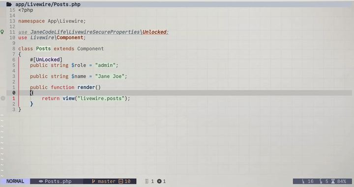

# tiny-textobject.nvim

[](https://x.com/janecodelife)
[](https://www.youtube.com/@JaneCodeLife)

A lightweight, simple, and dependency-free Easily handle text objects (inner/around) without need for Tree-sitter.

---

## 🚀 Features
* **`if` (Inner Function):** Selects everything *inside* the function braces (`{ ... }`), automatically trimming the top and bottom whitespace lines.
* **`af` (Around Function):** Selects the entire function block, including the function signature (`public function name()`, `class`, etc.) and the braces.
* **Smart Lookahead:** If your cursor isn't directly on a function block when you press `af`, it automatically searches forward for the next one.
* **No Treesitter required:** Perfect for lightweight setups or languages where Treesitter isn't fully configured.

---

💝 Support me by the only available way now: USDT to buy a new dev laptop. Info is below, 
or contact me by 📩 email: janecodelife@gmail.com

## Thank You So Much

---


## 📦 Installation

```lua
vim.pack.add({
	"https://github.com/janecodelife/tiny-textobject.nvim",
})

require("tiny-textobject").setup()
```

## Video 📺

<p align="center">
  
</p>

or in 

- **YouTube**: [https://youtu.be/qFnbg9WDQoU](https://www.youtube.com/watch?v=jBUKpSBhoxI) 

--- 

## ⌨️ Mappings

The plugin maps text objects in both **Visual** (`x`) and **Operator-pending** (`o`) modes.

| Keymap | Mode | Description |
|--------|------|-------------|
| `vaf`  | Visual | Select around the function |
| `vif`  | Visual | Select inside the function |
| `daf`  | Operator | Delete around the function |
| `dif`  | Operator | Delete inside the function |
| `yaf`  | Operator | Yank (copy) around the function |
| `yif`  | Operator | Yank (copy) inside the function |
| `caf`  | Operator | Change around the function |
| `cif`  | Operator | Change inside the function |

---


## 💝 Support the Project

> *This plugin is built entirely on developer insights gathered over **years of building real-world software** to catch common pain points, combined with **months of dedicated building and rigorous testing** to ensure it operates flawlessly.*

If this utility boosts your everyday speed and eliminates annoying file search clutter, please consider buying me a coffee or supporting my continuous maintenance!

You can tip or donate directly to my **TRON (TRX / USDT-TRC20)** crypto wallet address:
## ☕☕☕☕ Support Me Buy A Dev Labtop By Coffee Via USDT ☕☕☕☕

- **Network:** `TRX Tron (TRC20)`
- **Address:** `TAFFjBP39Z86weL5dDU1A2251VrgPprDUj`

> *Every bit of support fuels the expansion of this ecosystem and helps me write cleaner tools for all of us. Thank you for standing behind independent developers!* 🙏

---

##  If Have A Question🤝 (Contact Me)

I will be there i am answer to all messages

- **X (Twitter)**: [https://x.com/janecodelife](https://x.com/janecodelife)
- **YouTube**: [https://www.youtube.com/@JaneCodeLife](https://www.youtube.com/@JaneCodeLife) 
- **Email**: [janecodelife@gmail.com](janecodelife@gmail.com)

---

## 🔗 My Other Plugins

Check out my other open-source tools to supercharge your Neovim environment:
- **[livewire-secure-properties](https://github.com/janecodelife/livewire-secure-properties)** - Secure livewire app properties by default and void headache.
- **[todo-tracker.nvim](https://github.com/janecodelife/todo-tracker.nvim)** - Assign and list app todos in a blink
- **[folders-bookmark.nvim](https://github.com/janecodelife/folders-bookmark.nvim)** - Bookmark folders and accessing them by keymap in a blink
- **[copy-history.nvim](https://github.com/janecodelife/copy-history.nvim)** - Access your copy (Yank) history and paste it again by 1 click in a blink.
- **[rest-client.nvim](https://github.com/janecodelife/rest-client.nvim)** - run http request from anywhere in a blink


##  If Have A Question🤝 (Contact Me)

I will be there i am answer to all messages

- **X (Twitter)**: [https://x.com/janecodelife](https://x.com/janecodelife)
- **YouTube**: [https://www.youtube.com/@JaneCodeLife](https://www.youtube.com/@JaneCodeLife) 
- **Email**: [janecodelife@gmail.com](janecodelife@gmail.com)

---

A huge thank you to our sponsors! 

<!-- SPONSORS -->
<!-- SPONSORS -->

---

